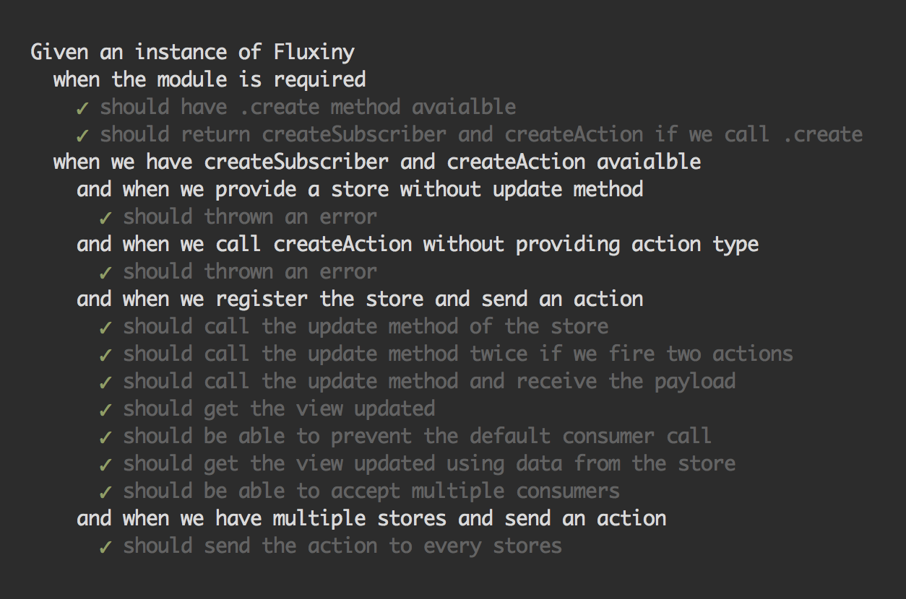

# Fluxiny

> [Flux architecture](https://facebook.github.io/flux/docs/overview.html) implemented in ~100 lines of code.


[Flux](http://facebook.github.io/flux/) is an architectural design pattern for building user interfaces. It was introduced by Facebook at their [F8](https://youtu.be/nYkdrAPrdcw?t=568) conference. Since then, lots of companies adopted the idea and it seems like a good pattern for building front-end apps. Flux is very often used with [React](http://facebook.github.io/react/). Another library released by Facebook. I myself use React+Flux in my [daily job](http://trialreach.com/) and I could say that the simplicity is one of the main benefits. This combination helps creating apps faster and at the same time keeps the code well organized. This library is a result of my experience using the pattern. I'm a big fan of simple and small, almost vanilla written JavaScript libraries. So, Fluxiny is created in the same manner.

---

#### Store

The Store in the context of Fluxiny is just a plain JavaScript object with an `update` method:

```js
var Store = {
  update: function (action, change) {
    // ...
  }
};
```

`action.type` contains the type of the dispatched action. In order to notify the view that the store updated its data we call the `change` method.

#### Action

The action is a JavaScript object with two properties - `type` and `payload`. `type` is usually a string and `payload` could be anything. We however don't create such objects. They are generated by Fluxiny. What we use in our app is a function representing the action. Once it's called the dispatcher sends the action to all the stores.

```
import Fluxiny from 'fluxiny';
const { createAction } = Fluxiny.create();

var action = createAction('SOMETHING_HAPPENED');

  // ... somewhere in the view
  action({ customProp: 'this is the payload' });
```

All we have to do is calling the action function and if we need to attach some data we pass it as an argument.

#### Dispatcher

We don't need a dispatcher. There is such but it's used by Fluxiny internally. The library is designed like that so the developer simply doesn't need it.

#### View

The view could be anything. As long as it has an access to a `subscriber` function. If it updates its state based on changes in the store we could say that satisfies the Flux pattern.

```js
var Store = {
  _data: { value: 0 },
  update: function (action, change) {
    // ... calculate the value
    change();
  },
  getValue: function () {
    return this._data.value;
  }
};

var subscriber = createSubscriber(store);

var View = function() {
  var state = { value: 0 };

  subscriber(function (store) {
    state.value = store.getValue();
  });
};

``` 

## Public API

```js
import Fluxiny from 'fluxiny';
const { createSubscriber, createAction } = Fluxiny.create();
```

* `createSubscriber` accepts our store and returns a subscriber function. 
* `createAction` accepts a string (type of action) and returns a dispatching function.

## Processes

Here are the main processes in the context of library:

#### Registering a store into the dispatcher

```js
var Store = { 
  update: function (action, change) { 
    // ...
  }
};
var subscriber = createSubscriber(Store);
```

#### Mutating the state of the store and notifying the view

The `update` method of the store accepts two arguments. An `action` with signature `{ type, payload }` and a function `change`. The store updates its internal state based on `action.type` and then fires `change()` notifying the view for that change.

```js
var Store = { 
  _data: { value: 0 },
  update: function (action, change) { 
    if (action.type === 'increase') {
      // mutation of the data
      this._data.value += action.payload;
      // notifying all subscribed views that the data is changed
      change();
    }
  }
};
```

#### Subscribing the view to changes in the store

```js
var Store = { 
  _data: { value: 0 },
  update: function (action, change) { 
    // updates _data.value
    change();
  },
  getValue: function () {
    return this._data.value;
  }
};
var storeSubscriber = createSubscriber(Store);

var View = function (subscriber) {
  var counterValue;

  subscriber(function consumer(store) {
    // updating the internal state of the view
    counterValue = store.getValue();
    // probably calling the render method
    // of the view
  });
};

View(storeSubscriber);

```
Notice how we need a getter in the store so the view could fetch the needed information. In Fluxiny the view says what it needs from the store and not the store pushes data to the view.

*Note that the `consumer` function is called at least once by default.*

#### Dispatching an action

Fluxiny uses the action-creator pattern. We specify the type of the action and as a result we get a function. Calling that function means dispatching the event. For example:

```js
var increaseAction = createAction('increase');

var View = function (subscriber, increaseAction) {
  // ...
  increaseButton.addEventListener('click', increaseAction);
};

View(subscriber, increaseAction);
```

In the example above all the stores will receive an action with `type` equal to `increase` and `payload` equal to mouse event object. Or in other words what we pass to `increaseAction` is attached to `payload` property of the action. In this particular example the browser sends an event object.

## Setup

As a script tag directly in the browser:

```html
<script src="fluxiny.min.js"></script>
<script>
  var Flux = Fluxiny.create();
  // Flux.createSubscriber
  // Flux.createAction
</script>
```

Via npm:

```
npm install fluxiny
```

Then simply import the module with

```js
// var Fluxiny = require('fluxiny');
import Fluxiny from 'fluxiny';
```

## Testing

Run the following command:

```
npm install && npm run test
```



## Resources

* [Dissection of Flux architecture or how to write your own](http://krasimirtsonev.com/blog/article/dissection-of-flux-architecture-or-how-to-write-your-own-react)
* Simple live demo of Fluxiny - [jsfiddle.net/krasimir/w0ne11bh](https://jsfiddle.net/krasimir/w0ne11bh/)
* Live demo using React - [krasimir.github.io/fluxiny/example/](http://krasimir.github.io/fluxiny/example/) and source code [here](https://github.com/krasimir/fluxiny/tree/master/example).